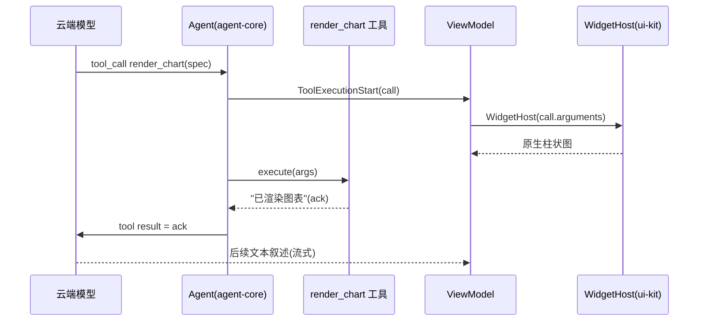

# Relay · UIKit(UI 工具化)

> 状态:已落地的实现合同(2026-08-23)。代码是最终事实源；本文记录模块边界、生命周期和验收闸门。
> 问题:Agent 想给用户展示图表/表格/卡片时,如何调用一套封装好的 UI 工具,把内容渲染进对话里?
> 拆成两个大问题:**① UI 引擎怎么设计;② UI 引擎怎么和 agent 联动。**
> 前提:项目已不依赖端侧模型,直连**云端(OpenAI 兼容)**,工具调用走 **provider 原生 function calling**。GBNF/端侧约束那套在这里不需要。
> 承接:工具两个桶(模型决定 vs 代码决定)见 [edge-tool-use.md](./edge-tool-use.md)。UI 产物使用独立 `:relay:artifacts`，不复用 memory 原文 blob 或 orchestra 内存 Store。

---

## 0. 结论先行

- **UI 引擎 = 一个纯渲染器**:输入 `WidgetSpec`(JSON),输出原生 Compose。不认识 agent/llm,可被任何来源驱动。
- **联动 = "widget spec 就是 tool-call 的参数"**:模型用 function calling 产出 spec,ViewModel 监听 `ToolExecutionStart` 事件拿参数渲染,工具 `execute()` 只回一句文本 ack。**`agent-core` / `relay/llm` 一行都不改。**
- **流式不丢**:text 和 tool_calls 是同一路流上的两种 chunk;要动的只是 ViewModel 的聊天项模型(有序 item + 活草稿),让文本流与 widget 按发生顺序穿插。
- **对话 app 里按大小分档**:小件包进气泡(inline),大件(图表/表格)破泡成全宽中性卡(block),重件折叠成预览点开进面板(canvas,v2)。

---

## 1. 心智模型

**`WidgetSpec`(JSON)是唯一的中间语言。** 一切围绕它转:

```
模型 --tool_call: render_chart(spec)--> Agent
Agent --AgentEvent.ToolExecutionStart(call)--> ViewModel --WidgetHost(call.arguments)--> 原生图表
Agent <--execute() 回 "已渲染柱状图…"(ack)-- UI 工具
用户点 widget --WidgetAction--> ViewModel --agent.prompt(...)--> 新 turn(v2)
```

分两层交付:
- `relay/ui-kit`(纯渲染,答 ①)—— 零 agent/llm 依赖。
- 一层薄胶水(答 ②)—— UI 工具的 `ToolDef` + ViewModel 监听。先放 `samples/playground`,稳了再抽 `relay/ui-agent`。

---

## 2. 问题①:UI 引擎怎么设计

### 2.1 定位与边界
纯函数式渲染器:`WidgetSpec → @Composable`。**不认识 agent**,可被工具 / 记忆 / 硬编码任意来源驱动。这条"零 agent 依赖"是模块纪律,别破。

### 2.2 三个核心件
1. **契约 `WidgetSpec`** —— 封闭集、带版本、**数据/表现分离**。
2. **封闭分发** —— `WidgetSpec` sealed 类型 + `WidgetHost` 穷举分发；不认识的 type **降级为文本**。
3. **宿主 `WidgetHost(spec, onAction)`** —— 唯一入口 composable:解析 → 分发 → 兜底。

`WidgetSpec` 的数据形状(**契约,不是实现**):

```json
{
  "type": "chart",           // chart | table | card | kv | choice_form | list | image | graph | file
  "version": 1,              // 版本
  "sourceId": "opt",
  "display": "BLOCK",
  "...": "各类型的数据字段；不放样式"
}
```

### 2.3 widget 目录 v1(封闭集 + 逃生口)
`markdown`、`chart`(bar/line/pie)、`table`、`kv`、`card`、`choice_form`、`list`、`image`、`graph`、`file`。`choice_form` 支持连续单选/多选、最终提交与只读回执；`taskAnchor` 必须绑定原始用户任务，提交续轮不使用自动记忆召回，也不把宿主合成文案写入长期学习队列。HTML 不作为可嵌套 widget；它是 `file` 指向的版本化产物，只能进入沙箱预览。

### 2.4 数据/表现分离(核心护栏)
spec 只带**数据 + 意图**(图类型、series、label);颜色/间距/字号归渲染器,走 App 的 `MaterialTheme`。**模型永远不设像素。** 这样模型的活很小,也出不了"排版崩坏"。

### 2.5 健壮性:输入不可信
spec 是 LLM 产物,必须防御式解析:宽松解析、忽略未知字段、缺字段给默认、解析失败 → 文本降级。**气泡永不因为脏 spec 崩。** 配 `v` 字段做版本协商:老 App 遇到新 widget → fallback 文本。

### 2.6 三档展示模式(对话 app 的关键)

| 模式 | 谁用 | 怎么放 |
|---|---|---|
| **inline(包进气泡)** | 小件:kv、短 list、单数据卡、caption | 和文本同一气泡,共用背景/左对齐 |
| **block(破泡)** | 表格、图片、choice form | 不穿气泡背景,近全宽中性 `Surface` 卡,挂在该轮回复下 |
| **canvas/expand** | 图表、图谱等重交互内容 | 流里显示预览,点开进全屏 |

`displayMode` 归**注册表**(不是模型)决定 —— 又一次数据/表现分离。大 widget 必须破泡:气泡 max-width 会挤扁图表,气泡 tint 会和图表配色打架。

### 2.7 交互模型:点击详细看(action 契约)
"点击详细看"不引入新机制,就是 `actions`(spec 声明可点)+ `onAction`(host 出口)+ `displayMode`(canvas/全屏)+ `WidgetHost` 递归 的组合。action 分两类,渲染器一眼能分:

- **`local`** —— host/渲染器**自己消化**:展开、全屏、tooltip、弹 sheet 渲染 spec 内已带的明细。**不出 widget、不回 agent。**
- **`emit`** —— **冒泡出去**:`onAction(WidgetAction{intent, payload, sourceId})` → ViewModel,再选"变成新 user turn"或"直调数据工具"(详见 3.9)。

三层下钻,便宜 → 强:

| 层 | 场景 | 走哪条 | 惊动模型? | 何时 |
|---|---|---|---|---|
| **① 自展开/全屏** | 图太小、表只显前几行 | `displayMode` block→canvas,同 spec 渲大 | 否,本地 | **v1 白嫖** |
| **② 下钻 spec 内明细** | 点某柱/某行弹详情 | 元素带 `detail` 子 spec → sheet 里 `WidgetHost(detailSpec)` | 否,本地(递归) | v1.5,零改 agent |
| **③ 下钻回环** | 明细不在 spec,要现查/现算 | 元素 `emit` action → onAction → 新 turn / 直调工具 | 是 | **v2** |

明细放哪:v2 起步**追加成新 turn group**;v2+ 用 `emit` 带的 `sourceId`(spec 的 `id`)做**原地更新**。

### 2.7b 流式 seam(先定接口,v1 不实现)
tool-call 参数流式到达,v1 **收齐再渲染**(widget 整块出现);渲染器可选支持 partial→骨架,后做。

### 2.8 两个别踩的坑
- **封闭集 + 逃生口** > 纯开放;原生保体验/安全,`html` 兜长尾。
- **浅层树**,不是通用布局引擎。card 里塞 chart+caption 就够了;任意嵌套布局是 DivKit 的活,对聊天场景过度设计。

### 2.9 引擎能力怎么建(不是堆 widget,是让加 widget 变便宜)
引擎能力 = **内核有多硬 + 加 widget 有多便宜**。分三步:

**① 先把内核做硬(一次做对,之后不动)。** 所有 widget 共用的承重墙,决定"加第 10 个还便不便宜":健壮解析(脏 JSON/缺字段/未知 type 永不崩)、注册表分发、fallback、`displayMode`、`WidgetHost` 递归、`onAction` 出口。**真正要投入的是这层。**

**② 把"加一个 widget"变成一张填空配方。** 内核对了之后,加任何 widget **只碰这 7 样,零跨模块改动**:

1. `type` 名 + props 数据类型(数据契约)
2. renderer(`spec → @Composable`)
3. `displayMode`
4. 校验/默认(缺字段兜底)
5. 对应 `ToolDef` schema(**与 props 同源**)
6. 黄金样例 spec(fixtures)—— 既做测试,又喂给 U1 当 few-shot/回归
7. `summary()` 兜底文本

**纪律:每个 widget 自带 fixtures + schema + fallback**,能力增长不带回归。这才是"能力怎么建"的核心——不是堆代码,是让每次增长安全、可测、**LLM 无关**。

### 2.10 能力 Tier 阶梯(按价值顺序填,每层独立可发可测)

| Tier | 内容 | 解锁/引入 |
|---|---|---|
| **0** | 内核 + `text/markdown` + fallback | 用最简单 widget 跑通整条管 |
| **1** | `kv` / `table` / `card` | 高频结构化只读,**不引图表库** |
| **2** | `chart`(bar/line/pie) | 引入 Vico,第一个"真视觉" |
| **3** | `list` / `image` | 补齐常见 |
| **4** | `onAction` local:展开/详情 sheet | 点击详细看 ①② |
| **5** | `html/webview` 逃生口 | 长尾可视化 |
| **6** | `emit` → 回环 agent | 点击详细看 ③(v2) |

先铺**广度**(常用类型),深度(每种更多花样/交互)后补。

---

## 3. 问题②:UI 引擎怎么和 agent 联动

### 3.1 核心:spec = tool-call 参数
UI 工具就是普通 `Tool`,它的 `parameters` JSON-schema = 对应 widget 的 props schema。**不发明新协议,不改 `Message` 结构。** v1 用**多个专用工具**(`render_chart`/`render_table`/`render_card`),schema 清晰 → 模型准确率高;别一上来做 `render_ui(union)` 大杂烩。

### 3.2 三条数据流

| 方向 | 怎么走 |
|---|---|
| **下行 model→UI** | 模型 `render_chart(args)` → args 即 spec → ViewModel 监听 `ToolExecutionStart(call)` → `WidgetHost(call.arguments)` |
| **回喂 UI→model** | 工具 `execute()` 只回一句文本 ack;**不回喂 spec/像素**(context 卫生) |
| **回环 UI→agent(v2)** | widget `WidgetAction` → ViewModel → `agent.prompt(...)` 新 turn,或纯本地态不惊动 agent |

### 3.3 第二通道的具体接法(已对着真代码验证)
`AgentEvent` 已暴露工具事件 `ToolExecutionStart(call)` / `ToolExecutionEnd(call, result, isError)`,而 `ToolCall` 自带 `name` + `arguments(JSON)`。现在 `AssistantViewModel` 只处理 `MessageUpdate → Text`,把 tool 事件 `else -> Unit` 丢了。**只需加一支**:监听 `ToolExecutionStart`,若 `call.name ∈ UI 工具集` → 用 `call.arguments` 当 spec 渲染。`agent-core`、`relay/llm` **一行不改**。

### 3.4 UI 工具是"半空"工具
职责只有两个:**(a)** 有个带 schema 的 `ToolDef`,让模型会调、知道怎么填;**(b)** `execute()` 返回一句 ack。**它自己不碰 UI** —— 渲染完全在 ViewModel 观察事件里做。这样 `agent-core` 保持 UI 无关,`ui-kit` 保持 agent 无关,两头干净。

### 3.5 流式不丢 + 有序 item + 活草稿
text 和 tool_calls 是同一路流上的两种 chunk,`ChatChunk.Text` 路径原样保留。真正要改的是聊天项模型:从"单个 `output` 缓冲 + 结尾提交一条 line"升级成**有序 item 列表 + 活草稿**:
- 流式文本进"当前草稿文本项"(实时增长);
- 遇到 UI 工具事件 → **封口当前草稿 → 插入 Widget 项 → 开新草稿** 接后续叙述。

这样既保留逐字流,又保证 `[开场白][图][叙述]` 顺序正确。参考 `GroupChatViewModel` 的 draft bubble。

### 3.6 聊天气泡:turn group,不是一个气泡
一轮助手回复 = 一个 **turn group**(共享头像/左对齐),里面竖排:文本气泡 + widget 块。小件 inline 进气泡,大件 block 破泡成全宽卡。视觉上归属同一轮,但宽 widget 不被气泡束缚。item 列表不变,只是渲染时按 `displayMode` 决定穿不穿气泡。

### 3.7 谁触发渲染(两个桶,都设计,先发第一个)
- **模型决定(agentic tool call)**:主路,如上。
- **代码决定(确定性)**:数据工具返回数据 → ViewModel/pipeline 用 formatter 包成 spec 渲染,模型不参与表现层。更可靠,适合固定报表。

### 3.8 三个工程要点
- **让模型知道何时用**:工具 `description` 写清触发场景 + system prompt 引导"能画就别打 markdown 表";拿到 ack 后别用文字复述图里的数。
- **持久化/回放**:widget 就是 message history 里的 tool call,**天然被持久化**,重放 transcript 自动重渲;大 spec 可 dedupe 进 `ArtifactStore` 留 ref。
- **单一事实源 + maxTurns**:`ToolDef.parameters` 与 `WidgetSpec` 渲染器读的字段必须同源(v1 手写贴紧,后续一处派生)。要"文本→图→叙述→再图"多段交错,`maxTurns` 需 ≥2。

### 3.9 对接清单(对接面极小)
关键原则:**引擎不 import agent,agent 不 import 引擎**,两者只在一层胶水(ViewModel/UiToolbox)相遇。所以能**先把引擎建到满能力、零 agent**,最后一下午接上。对接只动这几处,**核心零改**:

| 改动点 | 在哪 | 动了谁 |
|---|---|---|
| UI 工具定义(render_* 的 ToolDef + execute 回 ack) | `UiToolbox`(胶水) | 新增,不改核心 |
| 事件监听加一支 `is ToolExecutionStart ->` | ViewModel | 追加 Widget item |
| 聊天项 sealed 化(`Text`/`Widget` + 有序 item + 活草稿) | ViewModel/UI state | 改 state |
| 气泡按 `displayMode` 穿/破泡 | Compose UI | 渲染分档 |
| 完整 visible turn → `memoryText`（文本 + widget `summary()`） | ViewModel/胶水 | 给 Memory capture；不写 tool ack / 原始 spec JSON |
| (v2)`onAction(emit)` → `agent.prompt(...)` 回环 | ViewModel | 新增回环 |

`agent-core` / `relay/llm` **一行不改**。

---

## 4. 模块与边界

| 模块 | 内容 | 依赖 |
|---|---|---|
| `relay/ui-kit`(新) | `WidgetSpec`、`WidgetRegistry`、`WidgetHost`、内置渲染器、`displayMode`、`WidgetAction` | Compose + 图表库(Vico),**零 agent/llm** |
| 胶水(先在 `samples/playground`,稳后抽 `relay/ui-agent`) | `UiToolbox`(render_* 的 ToolDef,execute 回 ack)、ViewModel 监听 `ToolExecutionStart`、聊天项 sealed 化、气泡里调 `WidgetHost` | ui-kit + agent-core + llm |



---

## 5. Spike 验证设计

> 原则同 [spikes.md](./spikes.md):**先验"假设为假则方向死"且"最便宜就能验"的。** 没有阈值的 spike 是耍流氓。

### 承重假设(塌了 UIKit 就塌)
1. **云端模型能靠 function calling 稳定产出合法 widget spec** —— 地基。填不对参数,"UI 工具化"不成立。
2. **模型知道"何时"该渲染**(该画才画,画了别用文字复述)—— 判断力。
3. **流式文本 + widget 的交错顺序在多 turn 下 100% 正确** —— 纯工程,必过。

### Spike 卡片

**U1 · function-call 产出合法 spec(地基,先做)**
- 问题:DeepSeek(或同级 OpenAI 兼容)给定 `render_chart/table/card` 的 schema,能否在真实数据请求下产出**结构合法、字段齐全、数据正确**的参数?
- 实验:选 20–30 条会触发可视化的真实提问(数值对比 / 趋势 / 清单),挂上 UI 工具,统计:参数 JSON schema 合法率、数据正确率(值/label 对不对)、该触发时的触发率。对照 naive(仅 prompt 要 JSON,不给 schema)。
- 阈值:**schema 合法率 ≥95%、数据正确率 ≥90%、该触发时触发率 ≥80%**。合法率 <90% → 不能只靠裸 function calling,须加 `response_format` + 校验重试。
- 成本:0.5–1 天。**第一个该做的。**

**U2 · 触发判断力(该画才画)**
- 问题:模型会不会该画不画 / 不该画乱画 / 画了又用文字复述?
- 实验:混合集——一半"该可视化"、一半"纯文本更好";统计渲染决策 precision/recall,以及 ack 后重复复述率。
- 阈值:渲染决策 **F1 ≥0.8**;ack 后复述率 **≤20%**。差 → 调 tool description / system prompt。
- 成本:0.5 天,可并入 U1。

**U3 · 流式交错顺序正确性(纯工程,必过)**
- 问题:多 turn(文本→图→叙述→再图)下,有序 item + 活草稿能否保序、不吞文本、不错位?
- 实验:用 `ScriptedProvider` 造 `[text][toolcall][text][toolcall]` 序列,断言最终 item 顺序与流式增量;真机跑 `maxTurns≥2`。
- 阈值:顺序与内容 **100% 正确**(确定性工程)。
- 成本:0.5–1 天。

**U4 · 单一事实源不漂移**
- 问题:`ToolDef.parameters` 与渲染器读取的字段是否一致,改一处不漏另一处?
- 实验:每个 widget 用 schema 生成/校验一批样例 spec,断言渲染器都能吃;故意漂移一个字段,看测试是否抓到。
- 阈值:样例全通过;漂移能被 CI 抓到。
- 成本:0.5 天。

**U5 · 真机观感与性能(破泡/三档)**
- 问题:图表破泡全宽卡、表格、长列表在真机聊天流里的观感/滚动/性能?inline vs block 分档舒不舒服?
- 实验:playground 放 chart/table/kv/card 各若干,真机滚动、深浅色、窄屏;测帧率与首帧时延。
- 阈值:滚动 **≥55fps**、首帧 **<150ms**;主观 UX 过。
- 成本:1 天。跑通回路后做。

**U6 · html/webview 逃生口(可后置,非阻塞)**
- 问题:复杂可视化走沙箱 WebView 的安全边界、性能、观感能否接受?
- 实验:一个 ECharts/SVG 样例进沙箱 WebView(禁网络、JS bridge 白名单),测启动时延、内存、XSS 面。
- 阈值:启动 **<300ms**、无越权;不行就先不开这个口,只留原生 widget。
- 成本:1 天。

**U7 · 点击详细看/回环(大半工程,少半模型)**
- 问题:①②本地下钻(展开/全屏、`detail` 子 spec 弹 sheet)是否正确;③`emit`→新 turn 端到端是否跑通、明细是否对。
- 实验:本地部分用手写带 `detail`/`actions` 的 spec 断言 sheet 渲染与 `onAction` payload(**LLM 无关**);回环部分用 `ScriptedProvider` 断言 `emit → agent.prompt → 新 Widget item` 链路(**LLM 无关**);仅"回环后模型产对明细"那截连真模型。
- 阈值:本地下钻 **100% 正确**;回环链路 100% 跑通;回环明细正确率 ≥90%。
- 成本:1 天。非阻塞,排 U5 之后。

### 一眼优先级

| Spike | 验什么 | 挂了意味着 | LLM? | 序 |
|---|---|---|---|---|
| **U1 产 spec** | 地基 | UI 工具化改走"代码后处理产 spec",模型不直接产 | **要真模型** | **1** |
| U2 触发判断 | 判断力(=打磨我们的 tool 描述) | 加规则/后处理约束触发 | **要真模型** | 1(可并 U1) |
| U3 流式交错 | 工程正确性 | 必须修,不是选项 | 无关(Scripted) | 2 |
| U4 事实源 | schema 不漂 | 加 CI 守卫 | 无关 | 3 |
| U5 真机观感 | 体验闸 | 调分档/布局 | 无关(手写 spec) | 3 |
| U7 点击详细看 | 下钻/回环 | 交互降级为本地 | 大半无关 | 3 |
| U6 逃生口 | 长尾能力 | 先不开,只原生 | 无关 | 4 |

**边界:引擎 + 联接线的工程正确性(U3/U4/U5/U7 主体)全 LLM 无关、可 CI;只有 U1/U2 要连真模型,而它们本质在验并打磨我们自己的 tool 描述 + 参数 schema——真模型只是尺子。**

**go/no-go:U1 过了才值得铺 widget 目录与胶水;U3 是确定性工程,必过。**

---

## 6. 当前实现合同

### 6.1 模块
- `:relay:ui-kit`：Android/Compose 纯渲染模块，零 agent/llm/memory/storage 依赖。合同见 `WidgetSpec.kt`，防御解析见 `WidgetParser.kt`，入口见 `WidgetHost.kt`。
- `:relay:artifacts`：JVM 不可变产物仓库。manifest 原子替换，正文按 SHA-256 内容寻址；支持 create/revise/read/list/activate/feedback。
- `samples/playground`：唯一胶水层。`UiArtifactTools.kt` 暴露专用 function tools；`OrderedTurnReducer.kt` 按 `call.id` 保序并更新并行 tool。

### 6.2 产物生命周期
1. `write_markdown_artifact` / `write_html_artifact` 校验 UTF-8 单文件、名字、MIME、大小和静态风险。
2. Store 生成 `artifactId + version`，旧版本永不覆盖；tool result 只回 ref。
3. 对话在 ToolStart 插 pending 文件卡，ToolEnd 按 `call.id` 更新 ready/error。
4. 预览可切预览/源码/版本，可激活旧版本；反馈记录 viewport、诊断和元素标注。
5. “让 Relay 修复”生成显式新回合：先 `read_artifact`，再 `revise_artifact` 写新版本。禁止静默无限修复。

### 6.3 HTML 沙箱威胁模型
- 顶层是 `WebViewAssetLoader` 提供的 `https://appassets.androidplatform.net/assets/artifact-shell.html`，不使用 `file://` 或 `data:` 顶层文档。
- 模型 HTML 位于无 `allow-same-origin` 的 sandbox iframe。CSP 默认全禁，只允许 inline script/style、data/blob 图片以及 APK 内明确打包的本地资源。
- 禁止网络、文件/ContentProvider、Cookie/DOM Storage、定位、混合内容、弹窗、下载、顶层跳转和原生 JavaScript Bridge。
- 子页只能 `postMessage` 给可信外壳；外壳校验固定 Schema 和长度，再通过限定 appassets origin 的 WebMessage channel 发给 Kotlin。诊断永远按不可信文本处理。
- 收集 error、unhandledrejection、DOM ready/viewport、CSP 拦截、白屏超时和 renderer process gone；进程丢失降级到源码/摘要。

### 6.4 验收闸门
- 确定性测试：脏/未知 spec 降级；文本/tool 交错和并行结束 100% 保序；产物版本不可变；图布局确定；WebView 特权开关关闭。
- 可选真实模型评测：`-Drelay.liveUiEval=true`；Schema 合法率 ≥95%、数据正确率 ≥90%、触发 F1 ≥0.8。
- 真机：聊天滚动 ≥55 fps，原生 widget 首帧 <150 ms，约定大小 HTML fixture ready <300 ms。
- 饼图使用端上 Canvas（Vico 3.x 只提供 Cartesian 图层）；柱状图和折线图使用 Vico。

---

## 7. 现在别做的
- 通用布局引擎(DivKit 级嵌套布局)。
- 交互回环(widget→新 turn)的完整实现 —— 先留 `onAction` 缝。
- 流式半成品渲染(画一半的图)。
- 多 provider 抽象 —— 现在只有 OpenAI 兼容一条线,别提前抽。
- iframe/MCP-Apps 那套托管 UI 资源 —— 原生 App 不需要。

---

## 8. 一句话收尾

- **① 引擎怎么建**:spec 契约 + 注册表 + 兜底的纯渲染器;能力靠"内核做硬 → 加 widget 变 7 格填空配方(自带 fixtures/schema/fallback)→ 按 Tier 价值顺序铺",全程 **LLM 无关、可 CI**。
- **② 怎么接 agent**:"widget spec 即 tool-call 参数";引擎与 agent 互不 import,只在胶水相遇,对接 = 暴露工具 + 监听 `ToolExecutionStart` 一支 + 聊天项 sealed 化 + 按 `displayMode` 穿/破泡,**核心零改**;流式用"有序 item + 活草稿"保序。

先验 **U1**(模型能不能稳定产合法 spec,本质是打磨我们的 tool 描述/schema),过了再铺目录和胶水。
