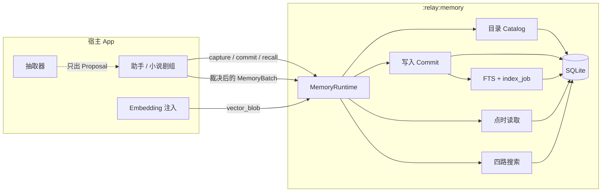
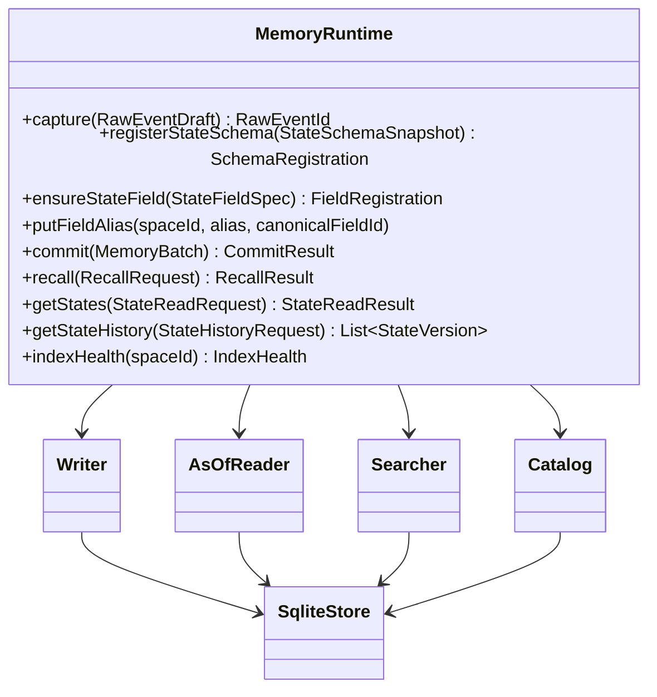
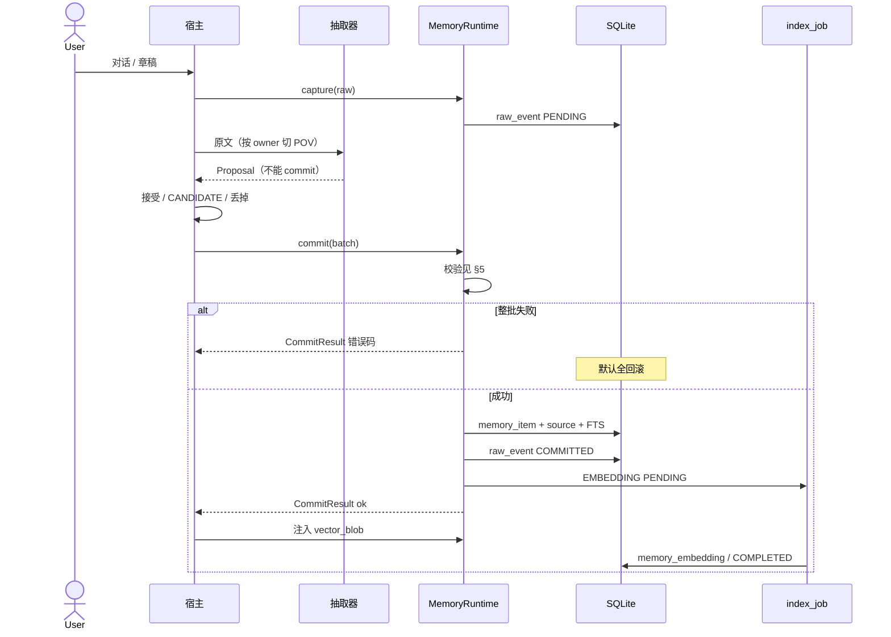
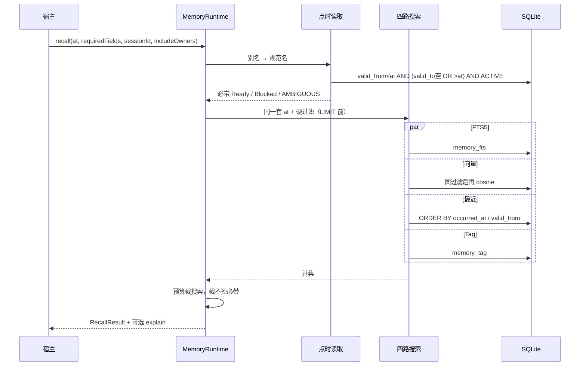
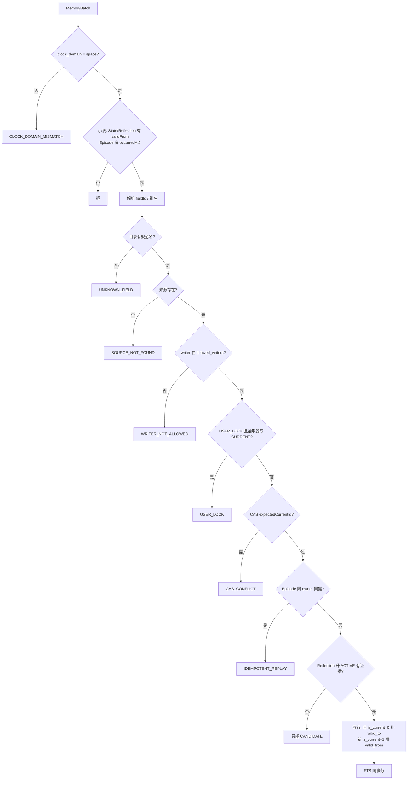
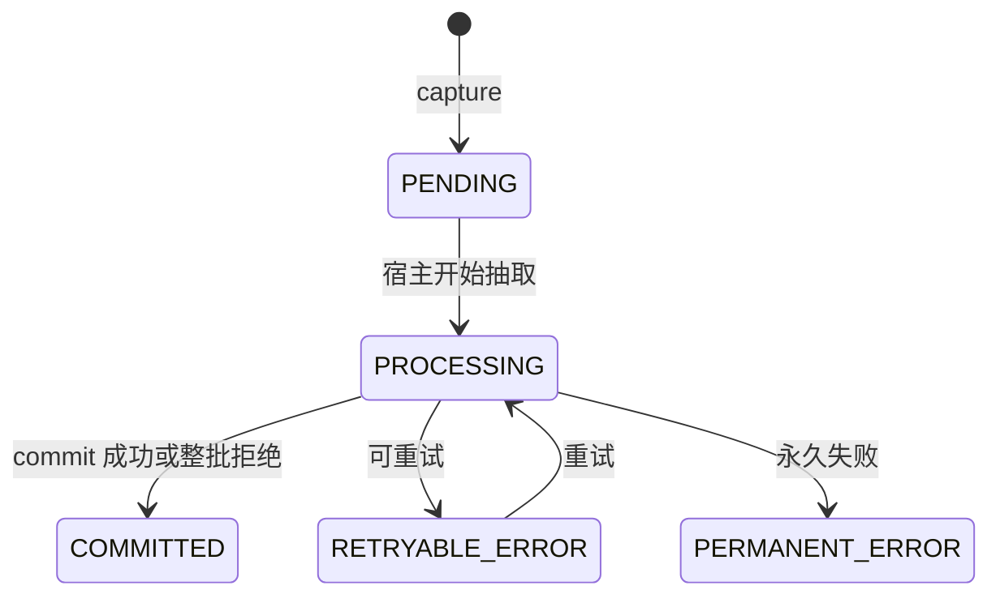
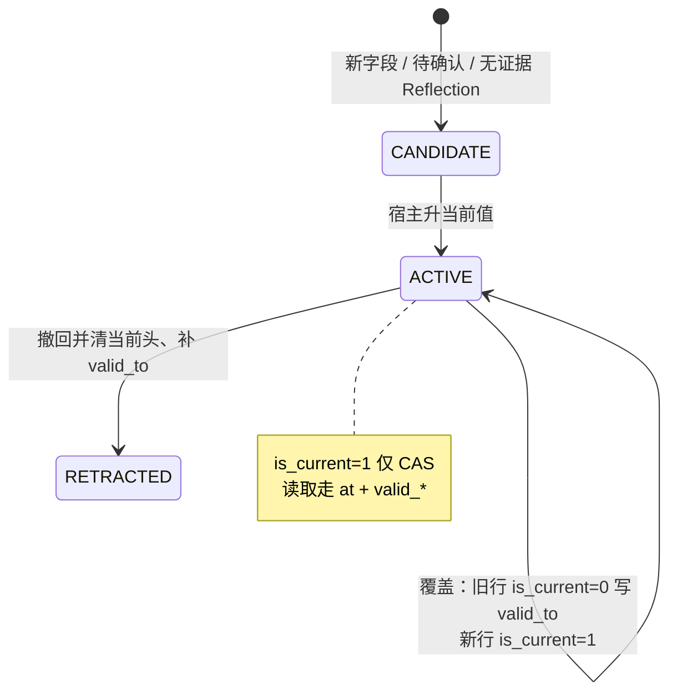
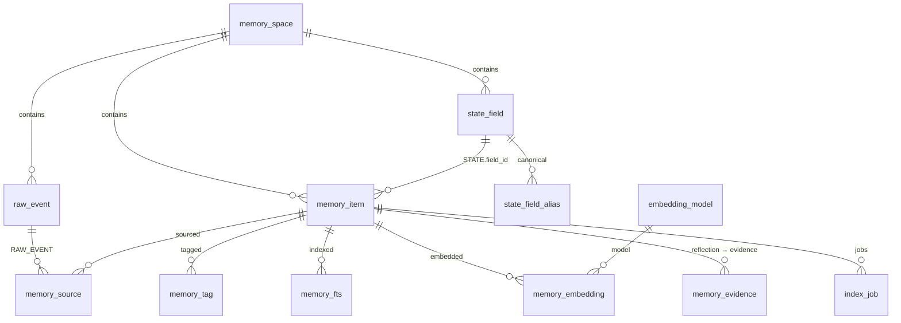

# 落地设计

目标合同的实现蓝图。接口 [api.md](./api.md)，表 [schema.md](./schema.md)，职责 [architecture.md](./architecture.md)。

**现有**图实现已丢掉。默认读就是新 `MemoryRuntime` / ledger。旧 OpenClaim / Triple **不迁**。

---

## 1. 组件

抽取器、LLM、必带清单、embedding 模型都在宿主。Memory 不持有模型，不 `commit` 自己抽出的东西。



宿主还负责：种子字段与别名、本轮 `requiredFields`、`includeOwners`、Scene 在场表（不进 Memory）。

---

## 2. 包

Gradle 模块仍是 `:relay:memory`。对内按包切开，**commit / recall 路径不依赖 `:relay:llm`**。抽取器在宿主，不进本模块。

```text
relay.memory.api        对外：MemoryRuntime、DTO、错误码
relay.memory.catalog    state_field / alias / ensure
relay.memory.write      capture、commit、USER_LOCK、CAS、时钟
relay.memory.read       getStates、getStateHistory、必带点时
relay.memory.search     硬过滤 SQL、FTS、向量 brute、recent、tag
relay.memory.index      同事务 FTS；异步 embedding job
relay.memory.engine     Room / SQLite 新表（与旧 node/edge 库分开或分 schema）
```



---

## 3. 写入时序



空抽取不自动 COMMITTED。宿主整批拒绝也要标 COMMITTED。向量失败不回滚正文。

---

## 4. 召回时序

两段，不要混。一次 `recall` 一个 `ownerId`。多角色 = 多次调用。



硬过滤（所有通道相同，写进 SQL，禁止先 ANN 再滤）：

```text
space_id = 请求
owner_id IN (ownerId ∪ includeOwners)
SESSION → scope_id = sessionId
TASK    → scope_id = taskScopeId
PROFILE 可入
STATE / REFLECTION → ACTIVE AND valid_from ≤ at
                     AND (valid_to IS NULL OR valid_to > at)
EPISODE → occurred_at IS NOT NULL AND occurred_at ≤ at
不用 is_current；不用 created_at / updated_at / captured_at
```

覆盖顺序（必带撞上多条同 field、同 at 有效）：`SESSION > TASK > PROFILE`，且 SESSION/TASK 的 `scope_id` 必须匹配请求。

---

## 5. commit 校验顺序

实现按这个顺序，测也按这个顺序。默认整批失败全回滚。



`USER_LOCK`：看 `(space, owner, fieldId)` **全部 scope**。任一当前值 `writer_kind=USER_EDIT`，抽取器在任何 scope 写 CURRENT 都拒。`overrideUserEdit` 仅 USER_EDIT / HOST。

Episode 唯一：`(space_id, owner_id, idempotency_key)`。两角色同键各一条都成功。

---

## 6. 状态机

**raw_event**



只有 COMMITTED 算消费完。空抽取不自动到 COMMITTED。

**memory_item**



非法：`is_current=1` 且非 ACTIVE。CANDIDATE 永不当当前值，不进四路 ACTIVE 过滤。

---

## 7. 表关系



点时读 **禁止** `WHERE is_current=1`。`is_current` 只配合唯一索引做写入 CAS。

---

## 8. 落地钉死（合同歧义）

这三条按此实现，测试按此写。比口头「宿主自觉」优先。

**includeOwners 与必带**

- `getStates` / 必带：别名解析后，**先**在 `ownerId` 上按 `at` 取 ACTIVE 版本。
- 若 `includeOwners` 非空：同一 `fieldId` 在外 owner 上也有 `at` 有效 ACTIVE，且 payload 不同 → `AMBIGUOUS_FIELD`（Blocked）。payload 相同不冲突。
- 四路搜索：`owner_id IN (ownerId ∪ includeOwners)`，**不做** fieldId 去重。世界仓不要种 `location` / `current_goal` / `affiliation`。
- `includeOwners=[]` 仍读到外 owner → bug。

**小说 scope**

- 正史 State / Episode / Reflection → `PROFILE`。
- `SESSION` 不当写作草稿。生成用的 `sessionId` 不得复用编辑器会话名。
- 本场站位若与驻地冲突：宿主多种子（如 `residence` vs `location`），或本回用 `TASK` 且 `taskScopeId=章号`，闭场写 `valid_to`。Memory 不发明 SCENE。

**别名**

- `putFieldAlias`：`canonical` 必须已在目录；`alias` 不得等于其它 `field_id`（指向自己除外）。
- `ensureStateField`：入参命中已有别名 → 复用规范名，不建第二槽。
- 先 `ensure(位置)` 再挂到 `location`：拒挂，两槽并存，读冲突走 `AMBIGUOUS_FIELD`。不自动并值。

---

## 9. 切片与测试

按切片合入。每刀对应 PRD 验收，不过不算做成。

| 刀 | 做 | 先绿 |
|---|---|---|
| 0 | 新表 + `memory_space` 时钟域 | 错域写入拒 |
| 1 | catalog：ensure / alias | 未占槽点不到；alias 抢 field_id 拒 |
| 2 | capture + commit State/Episode（无向量） | 并发一个当前值；小说缺时钟拒；幂等含 owner |
| 3 | 点时 `getStates` + 必带 | `at=30` 无 `valid_from=80`；缺 → Blocked |
| 4 | 四路：FTS + recent + tag；硬过滤在 LIMIT 前 | 跨 owner 零条；SESSION `scope_id`；旧住址已闭窗不进搜索 |
| 5 | USER_LOCK 跨 scope | PROFILE 手改后 SESSION CURRENT 拒 |
| 6 | 异步向量；失败不回滚 | 删向量表，必带+FTS+Recent 仍可用 |
| 7 | Reflection + evidence | 无证据不能 ACTIVE |
| 8 | （不做）不迁旧图 | — |
| 9 | 拆旧图：删 node/edge/`learn()`，宿主接 ledger | 模块与 sample 编译；合同测仍绿 |

旧图直接丢掉，不保留 `learn()` / `dayTools` 兼容层。
